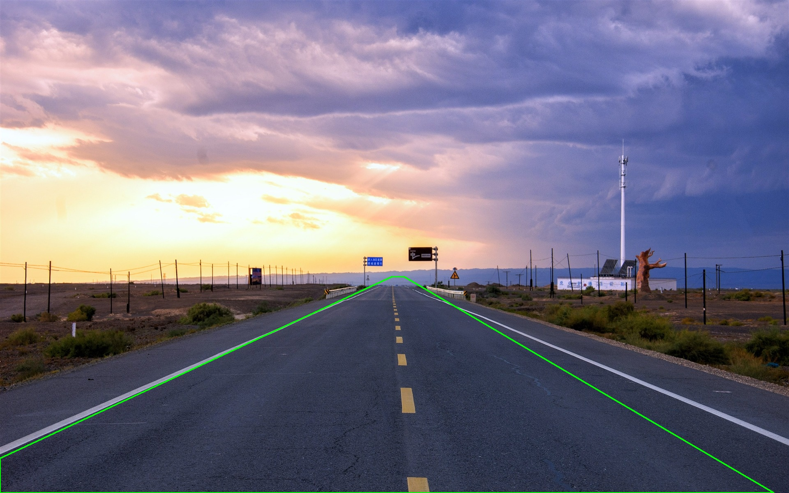
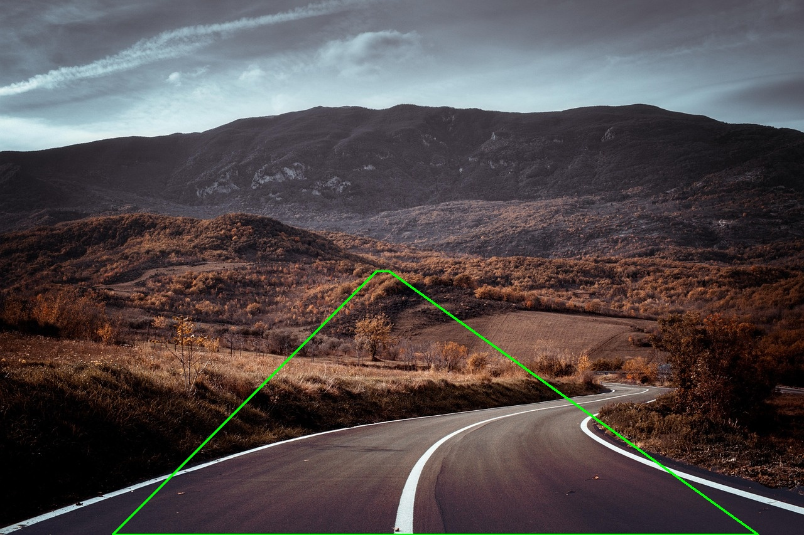
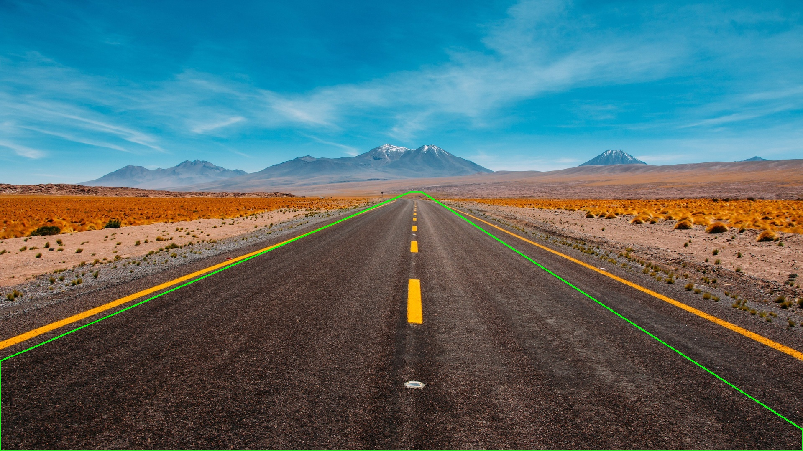
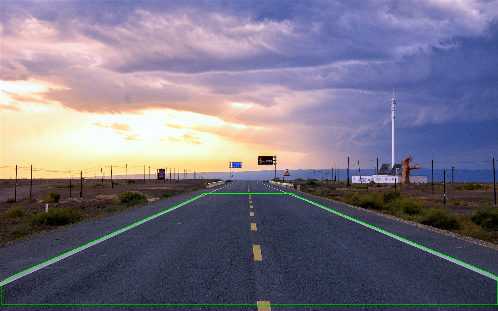
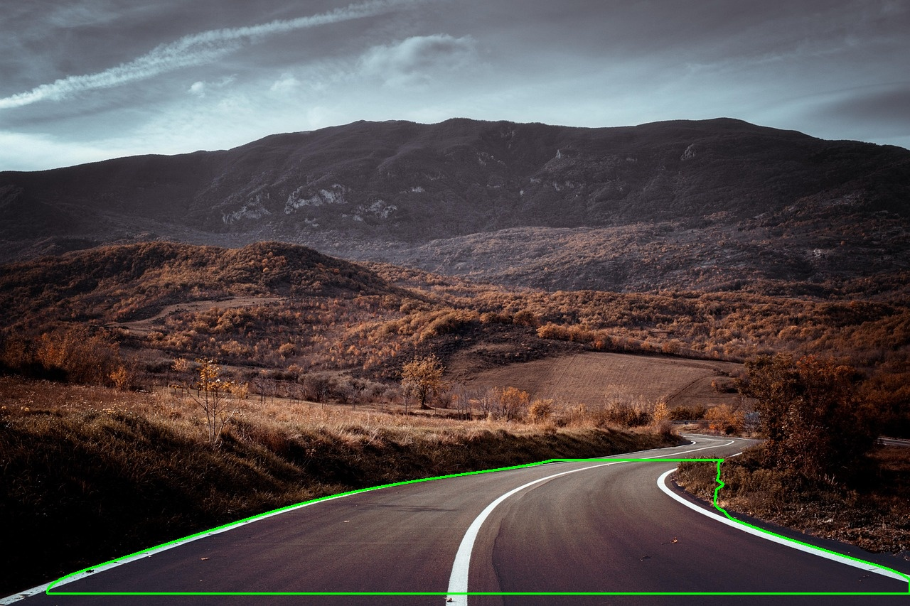

# Road Contour Laboratory

使用 Python 與 OpenCV 實作道路輪廓擷取實驗。專案目前保留兩條 pipeline：

- Pipeline V1：以傳統特徵融合、區域成長、連通元件篩選，再搭配直線道路幾何修正。
- Pipeline V2：針對彎曲道路新增曲線邊界追蹤，並加入車道/路緣標線導引與失敗時的幾何 fallback。

## 專案結構

```text
road-contour-lab/
├─ main.py
├─ configs/
│  └─ default_config.py
├─ data/
│  ├─ input/
│  └─ output/
└─ src/
   ├─ contour/
   ├─ features/
   ├─ pipeline/
   ├─ preprocessing/
   ├─ segmentation/
   └─ utils/
```

## 使用方式

安裝套件：

```cmd
python -m pip install --upgrade pip setuptools wheel
python -m pip install -r requirements.txt
```

執行 Pipeline V1：

```cmd
python main.py --input data/input/1.jpg --output_dir data/output --pipeline v1 --min_area 1000
```

執行 Pipeline V2：

```cmd
python main.py --input data/input/1.jpg --output_dir data/output --pipeline v2 --min_area 1000
```

輸出中間結果：

```cmd
python main.py --input data/input/1.jpg --output_dir data/output --pipeline v2 --min_area 1000 --save_intermediate
```

## Pipeline V1 方法

V1 是原始的直線道路流程，主要步驟如下：

```text
Input Image
  -> Grayscale
  -> Gaussian Blur
  -> Sobel Feature Extraction
  -> LBP Feature Extraction
  -> Feature Fusion
  -> Candidate Mask Thresholding
  -> Distance Transform
  -> BFS Region Growing
  -> Connected Components Filtering
  -> Hough Line Road Geometry Refinement
  -> Contour Extraction
```

V1 適合直線道路或接近直線透視的道路。它會使用 Canny + HoughLinesP 找出左右道路線，再建立幾何遮罩修正道路區域。

## Pipeline V2 方法

V2 針對彎曲道路新增以下策略：

- 逐列追蹤道路左右邊界，不強制道路必須是兩條直線。
- 使用曲線平滑重建道路 mask。
- 偵測白色與黃色車道/路緣標線，當標線可信時用 marker-guided mask 輔助道路輪廓。
- 若 marker-guided 結果貼近影像邊界、上緣過寬或形狀不可信，會拒絕該結果。
- 若曲線追蹤信心不足，會 fallback 到 V1 的道路幾何修正，避免輸出貼邊大矩形或錯誤區塊。

相關實作：

- `src/segmentation/curve_road_geometry.py`
- `src/pipeline/road_contour_pipeline.py`
- `configs/default_config.py`

## 結果輸出

目前 `data/output` 保留 Pipeline V1 與 Pipeline V2 的最終輪廓圖。

### Pipeline V1

| Input | Output |
| --- | --- |
| `data/input/1.jpg` |  |
| `data/input/2.jpg` |  |
| `data/input/3.jpg` |  |

### Pipeline V2

| Input | Output |
| --- | --- |
| `data/input/1.jpg` |  |
| `data/input/2.jpg` |  |
| `data/input/3.jpg` |  |

## 參數設定

主要設定集中在：

```text
configs/default_config.py
```

常用參數包含：

- `candidate_mask.threshold`
- `contour.min_area`
- `road_geometry.*`
- `curve_road.*`
- `pipeline_version`

## 驗證指令

語法檢查：

```cmd
python -m compileall src main.py configs
```

重新產生目前結果：

```cmd
python main.py --input data/input/1.jpg --output_dir data/output --pipeline v1 --min_area 1000
python main.py --input data/input/2.jpg --output_dir data/output --pipeline v1 --min_area 1000
python main.py --input data/input/3.jpg --output_dir data/output --pipeline v1 --min_area 1000

python main.py --input data/input/1.jpg --output_dir data/output --pipeline v2 --min_area 1000
python main.py --input data/input/2.jpg --output_dir data/output --pipeline v2 --min_area 1000
python main.py --input data/input/3.jpg --output_dir data/output --pipeline v2 --min_area 1000
```
